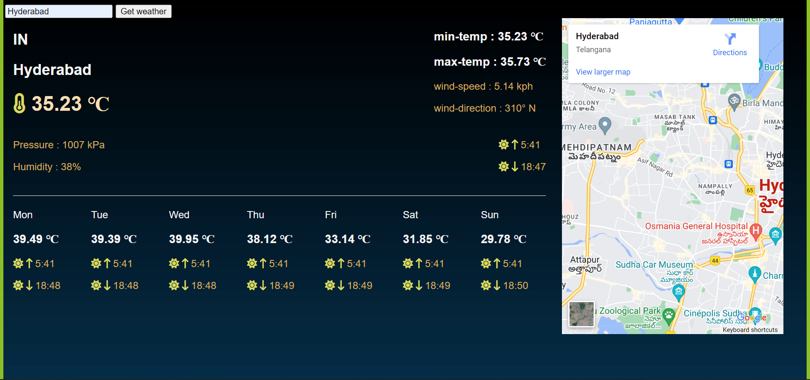

# WeatherApp

This project is may by only me during unit 3 of masai school.This is a weather forecast which will provide the current weather Info and a week forecast weather of any given location with the Integration of Google maps api it also shows the location on maps of an entered location name. 
  

-If you want to visit our project then just click on the link given below:
[Project Netlify link](https://elastic-joliot-d8b259.netlify.app/)

## Technoligies used 
<!--  -->
- HTML
- CSS
- Advance JS(API/ES6)

---
## Contributors
No contributors

## API Reference

### API used

- [Open Weather API](https://openweathermap.org/api)
- [Google Maps Embed API](https://developers.google.com/maps/documentation/embed/get-started)

## Website Sneak Peaks

- **Weather Image 1**

- **Weather Image 2**

